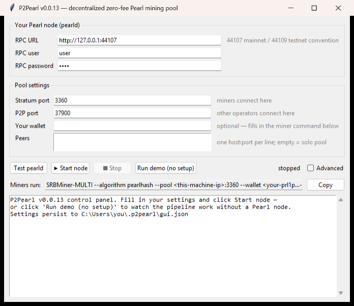

# P2Pearl

**Mine [Pearl](https://github.com/pearl-research-labs/pearl) together. Keep 100 %.**

P2Pearl is a mining pool with **no company behind it**: no operator, no account, no signup, and a **0 % fee**. When the pool finds a block, the block itself pays every recent miner their share, straight to their own wallet. There is nobody to take a cut, run off with funds, or get shut down — the same idea as Monero's P2Pool, built for Pearl.

[](https://github.com/JustAResearcher/P2Pearl/releases/latest) [](LICENSE) 

<p align="center"></p>

## Get started in 2 minutes

1. **Download** the latest release: [`p2pearl.exe`](https://github.com/JustAResearcher/P2Pearl/releases/latest) (Windows) or `p2pearl-linux-x86_64` (Linux).
2. **Double-click it.** The control panel above opens. *(Linux: `chmod +x p2pearl-linux-x86_64 && ./p2pearl-linux-x86_64 gui`)*
3. Pick your path:
   - 👀 **Just curious?** Click **Run demo (no setup)** and watch two pool nodes find shares, gossip, and split a reward — live, on your machine, nothing to configure.
   - ⛏️ **Have a GPU? Mine.** [Two steps below.](#i-want-to-mine)
   - 🏗️ **Want to host a pool node?** [See below.](#i-want-to-run-a-pool-node)

Your settings are saved automatically, so every launch after the first is open-and-click.

## I want to mine

You don't install anything from P2Pearl — your existing miner just points at a P2Pearl node instead of a normal pool:

1. Get [SRBMiner-Multi](https://github.com/doktor83/SRBMiner-Multi/releases) (the standard Pearlhash miner).
2. Run it with a P2Pearl node's address and **your own wallet**:

   ```
   SRBMiner-MULTI --algorithm pearlhash --pool <node-address>:3360 --wallet <your-prl1p...-address> --disable-cpu
   ```

That's it. There is no account and no withdraw page: **when the pool finds a block, the block's own coinbase pays you directly**, proportional to the shares you contributed recently. Nothing to claim, nothing to withdraw, no fee taken. (Rewards smaller than 0.001 PRL roll over to the next block — never lost.) Pool operators can see a live **Payout estimate** panel in the GUI showing each wallet's current PPLNS share and next-block estimate.

> Tip: anyone running the control panel can hand you the exact command — it's the **"Miners run:"** line at the bottom of the window, with their port and your placeholder pre-filled.

## I want to run a pool node

A pool node is the thing miners point at. You can run one for yourself, your friends, or the whole network — it pays you nothing extra (that's the point: 0 % fee), but it makes the pool exist.

- **Windows — one exe, nothing else.** `p2pearl.exe` contains the entire stack, *including the Pearl full node itself*. Double-click it, leave **"Run pearld for me"** ticked, click **▶ Start node** — it unpacks `pearld` to `~/.p2pearl/bin`, starts it, shows the sync progress live, and launches the pool automatically the moment the chain is ready. Validated end-to-end on a single Windows machine (blocks built, mined, and ZK-proved on Windows, accepted by a native-Windows `pearld`).
- **Linux** — you run your own `pearld`, plus a one-time ~15-minute build of Pearl's proof verifier: the copy-paste walkthrough is [`docs/running-a-node.md`](docs/running-a-node.md).

The control panel flow (double-click the exe, or `p2pearl gui`):

1. **"Run pearld for me"** (Windows, on by default): pick mainnet or testnet and skip to step 3. Running your own `pearld` instead? Untick it and fill in **RPC URL / user / password**.
2. Click **Test pearld** — it tells you if the connection works.
3. (Optional) Add **Peers** — other operators' addresses, one per line. This merges you into one big shared pool; leave empty to run your own private pool.
4. Click **▶ Start node.** The live log streams in the window (with sync progress if pearld is managed). Copy the **"Miners run:"** command to your miners. Closing the window shuts everything down cleanly.

Prefer a terminal or a server? The same thing as one command: `p2pearl daemon --rpc-url ... --peer ...` — every flag is documented in the [configuration reference](#configuration-reference) below, including ready-made systemd units.

## FAQ

**Is there really no fee?** Really. The reward-splitting rule is enforced by every node in the pool — a coinbase that pays anyone an "operator cut" is rejected by consensus. There is no donation address, no dev tax, nothing.

**Where does my money go?** Into the Pearl block itself, addressed directly to your wallet. Look at any block the pool mines: one output per recent miner. No middleman ever holds funds.

**Do I have to trust the node I mine on?** Much less than a normal pool. Payouts are computed deterministically from the shared sharechain and cross-checked by every peer — an operator can't skim or reroute them. (Like any pool, the node you point at could ignore your shares — if you don't like a node, point at another or run your own.)

**Do I need to keep P2Pearl open to mine?** No. Only the node operator runs P2Pearl; miners just run their miner.

**What does the demo do? Is it safe?** It simulates a two-node pool entirely on your machine — no network, no wallet, no real coins. It's there so you can see how everything fits together.

**Mainnet or testnet?** The software has mined real, confirmed blocks on Pearl's **public testnet**, including blocks paying two independent operators' miners in one coinbase. Treat mainnet as early: the remaining hardening items are listed in [Status](#status--how-to-test).

**Pearl v2 / MoE fork?** Supported. Live-node testing now requires a Pearl node that reports `requiredcertversion` in `getblocktemplate` (Pearl `pearld` 1.1.0 or newer). If the GUI-managed node is older, **Start node** stops immediately with an upgrade message instead of waiting forever.

**Where are my settings?** `~/.p2pearl/gui.json` (shown in the log pane). Delete it to reset.

**The window closed instantly / something else is wrong?** See [Troubleshooting](#troubleshooting).

---

# For operators & developers

Everything below is reference material — you don't need it to use P2Pearl.

## Configuration reference

**The easy way is the GUI** (`p2pearl gui`): it covers every setting below (rare ones behind the *Advanced* toggle), persists them to `~/.p2pearl/gui.json`, tests your pearld connection, and starts/stops the daemon with a live log. It is a thin wrapper — it launches `p2pearl daemon` with exactly the flags documented here. The release `p2pearl.exe` bundles the native proof stack, so a Windows node is download-and-run; a *source* install needs the `pearl_mining` build from [`docs/running-a-node.md`](docs/running-a-node.md) (without it, Start tells you exactly what's missing, and the demo runs anywhere).

For the daemon itself there is **no config file** — it is configured entirely by command-line flags and a few environment variables; the *sidechain consensus* lives in code (`src/p2pearl/config.py`) and must be identical on every node.

### `p2pearl daemon` flags

| Flag | Default | What it does / when to change it |
|---|---|---|
| `--rpc-url` | `http://127.0.0.1:44107` | Your `pearld` JSON-RPC endpoint. `44107` is the mainnet convention; this guide uses `44109` for testnet. Must match `pearld`'s `--rpclisten`. |
| `--rpc-user` | `user` | `pearld` RPC username (must match `--rpcuser`). Prefer the env var below for secrets. |
| `--rpc-pass` | `pass` | `pearld` RPC password (must match `--rpcpass`). Prefer the env var below. |
| `--stratum-host` | `0.0.0.0` | Bind address for the miner-facing stratum listener. Use `127.0.0.1` to accept only local miners. |
| `--stratum-port` | `3360` | The port miners point `--pool` at. |
| `--p2p-host` | `0.0.0.0` | Bind address for the share-gossip listener. |
| `--p2p-port` | `37900` | The port other operators `--peer` to. |
| `--peer HOST:PORT` | *(none)* | Another operator's P2P endpoint. **Repeatable.** With no peers you run a solo pool (still feeless, still PPLNS across your own miners). Peering merges everyone into ONE pool: shares gossip both ways, every node trustlessly re-verifies them, and any node's block pays the whole network's window. New nodes window-sync the recent sharechain automatically on connect. |
| `--share-target INT\|HEX` | built-in | **Consensus — leave it alone** unless you are bootstrapping a brand-new private sidechain. Overrides only the GENESIS bootstrap target (`0x…` hex or decimal); after genesis the target retargets automatically. Every node on the same sidechain must use the same value or they will reject each other's shares. |
| `--pause-cmd CMD` | *(none)* | Shell command run just before the (rare, CPU-heavy) block-prove — e.g. `'pkill -STOP -x xmrig'` to pause a co-located CPU miner. Cuts prove time ~3× on a busy box. Bounded by a 10 s timeout; failures never block a found block. |
| `--resume-cmd CMD` | *(none)* | Undoes `--pause-cmd` right after the prove — e.g. `'pkill -CONT -x xmrig'`. Also run once at startup to self-heal a crash that died mid-prove. |

### Environment variables

| Variable | Default | Purpose |
|---|---|---|
| `P2PEARL_RPC_USER` / `P2PEARL_RPC_PASS` | — | RPC credentials, instead of putting them on the command line (visible in `ps`). Flags win if both are set. |
| `RAYON_NUM_THREADS` | auto (= logical CPUs) | Thread count of the Rust ZK prover. The daemon pins this automatically — leaving it unset upstream makes a found-block prove ~2× slower under load. Export it yourself only to *reduce* threads. |
| `_RJEM_MALLOC_CONF` | `background_thread:true` | jemalloc tuning for the prover (set automatically). Do **not** set `dirty_decay_ms:-1` on a memory-constrained box — it OOMs. |
| `PYTHONPATH` | — | Must include `pearl/miner/pearl-gateway/src` (for block/ZK-certificate serialization; pure Python, no torch). Source installs only — the test suite and demo don't need it. |

### Ports at a glance

| Port | Protocol | Direction | Forward through your router? |
|---|---|---|---|
| `3360` | stratum (TCP) | miners → your node | Only if miners outside your LAN should reach you |
| `37900` | P2P gossip (TCP) | other operators ↔ you | Yes, if you want inbound peers (outbound `--peer` works without it) |
| `44107` / `44109` | pearld JSON-RPC | daemon → pearld, localhost | **Never** expose this publicly |
| `44060` / `44110` | pearld chain P2P | pearld ↔ Pearl network | Recommended for a well-connected full node |

### `pearld` settings that matter to P2Pearl

A known-good `~/.pearld/pearld.conf` for a pool node (testnet):

```ini
testnet=1          ; drop for mainnet
notls=1            ; or configure TLS and use https:// in --rpc-url
rpcuser=u
rpcpass=p
rpclisten=127.0.0.1:44109
```

The daemon polls `getblocktemplate` every ~2 s and calls `submitblock`; no wallet, indexes, or special flags are required in `pearld`. The daemon fails fast at startup if it can't reach the RPC (check URL/credentials first — see Troubleshooting).

### Sidechain consensus parameters (`src/p2pearl/config.py`)

These define the sidechain itself. **Every node on a sidechain must agree on all of them — changing any one forks you off the pool.** They are deliberately not flags.

| Constant | Value | Meaning |
|---|---|---|
| `SIDECHAIN_VERSION` | `3` | Share format/rules version. v3 = consensus retarget + subsidy-exact coinbase. v2 shares are rejected (and vice versa), so all peered nodes must run the same major version. |
| `SHARE_TARGET_TIME_SECONDS` | `10` | The retarget aims for one share per 10 s **pool-wide**. |
| `RETARGET_WINDOW_SHARES` | `60` | Work-rate look-back for the retarget (~10 min of shares). |
| `RETARGET_CLAMP` | `4` | A share's target may move at most 4× per share, either direction (damps oscillation and timestamp games). |
| `BOOTSTRAP_SHARE_TARGET` | difficulty 64 | The genesis share target; the retarget takes over from share #2. Override per-deployment with `--share-target` (consensus!). |
| `MAX_TIMESTAMP_DRIFT_SECONDS` | `300` | Shares stamped >5 min into the future are rejected (protects the retarget). |
| `PPLNS_WINDOW_SHARES` | `1000` | The coinbase pays the miners of the last N shares, proportional to share difficulty (~2.8 h of shares at target rate). |
| `UNCLE_BLOCK_DEPTH` / `UNCLE_PENALTY_PERCENT` | `3` / `20` | Orphaned-but-recent shares still count: full weight for chain selection, 80 % weight for payout. |
| `MIN_PAYOUT_GRAINS` | `100000` (0.001 PRL) | Below this, a miner is skipped *this* block; their shares stay in-window for the next one. |

Two consensus rules worth knowing as an operator:

- **Share targets are not negotiable.** Every share must carry exactly the target the sharechain derives for its position (`Sharechain.expected_target`). Your node computes it, stamps it into jobs, and rejects any gossiped share that disagrees — so no peer can manufacture cheap weight or flood the chain.
- **Coinbase values are subsidy-exact.** Shares are coinbase-only (no mempool transactions yet), and every share's `coinbase_value` must equal Pearl's emission schedule for its height — replicated from `pearld`'s `CalcBlockSubsidy` and validated grain-for-grain against a live node. A finder cannot inflate the pot, and your blocks can never overpay (which `pearld` would reject).

### Running as a service (systemd)

```ini
# /etc/systemd/system/pearld.service
[Unit]
Description=Pearl full node
After=network-online.target
[Service]
ExecStart=/opt/pearl/bin/pearld --configfile=/root/.pearld/pearld.conf
Restart=always
[Install]
WantedBy=multi-user.target

# /etc/systemd/system/p2pearl.service
[Unit]
Description=P2Pearl pool node
After=pearld.service
Requires=pearld.service
[Service]
Environment=PYTHONPATH=/opt/pearl/miner/pearl-gateway/src
Environment=P2PEARL_RPC_USER=u
Environment=P2PEARL_RPC_PASS=p
ExecStart=/opt/venv/bin/p2pearl daemon --rpc-url http://127.0.0.1:44109 \
    --peer <other-operator>:37900
Restart=always
[Install]
WantedBy=multi-user.target
```

`systemctl enable --now pearld p2pearl` and both survive reboots. (The public testnet node runs exactly this shape.)

### Prover speed (don't lose found blocks)

The only latency between *finding* a block and *announcing* it is generating its ZK certificate (~3–17 s of pure CPU). The daemon already pins prover threads, proves in a worker thread, serializes and dedups proves; your two knobs are `--pause-cmd`/`--resume-cmd` (pause co-located CPU load → ~3× faster prove) and **collaborative submission**, which is automatic: every peered node races to prove-and-submit any block-clearing share the moment it arrives, so the pool's orphan exposure is the *fastest* node's prove time, not each finder's. Full measurements in [`docs/running-a-node.md`](docs/running-a-node.md#prover-speed--avoiding-orphaned-blocks).

### Troubleshooting

| Symptom | Cause / fix |
|---|---|
| `could not reach pearld at …` on startup | Wrong `--rpc-url`/credentials, or `pearld` still syncing. The GUI's **Test pearld** button checks exactly this. |
| GUI says managed `pearld` is too old | Pearl's June 2026 MoE hard fork requires v2 certificates. Use an updated P2Pearl bundle or untick **Run pearld for me** and point the RPC URL at `pearld` 1.1.0 or newer. |
| SRBMiner shows alternating accepted / `duplicate` shares | Update to v0.0.21 or newer. Fast GPUs can submit an extra proof against the previous clean job; P2Pearl treats that harmless duplicate as an idempotent success. |
| Miner connects but never gets a job | The daemon primes its first job from `getblocktemplate` — if `pearld` is mid-sync, GBT errors until it reaches the tip. Wait for sync. |
| Shares rejected: `share does not meet target` | Normal occasionally (the miner raced a retarget/job refresh). Constant rejections → miner is on the wrong algorithm or a stale connection; restart the miner. |
| Gossiped shares rejected: `bad share target` / `bad coinbase value` | The peer is on different consensus (old version, or a different `--share-target` bootstrap). All nodes must run the same `SIDECHAIN_VERSION` and genesis target. |
| Peer connect fails | Their `37900` isn't reachable (port-forward/firewall), or version mismatch. Outbound `--peer` needs no forwarding on *your* side. |
| Block found but not on-chain | Likely orphaned — another miner found the height first while proving. Keep the prover fast (`--pause-cmd`, peers for collaborative submit). |
| No window opens on Linux | Headless session (SSH) — the binary says so and points you at `p2pearl daemon`. The GUI needs a desktop. |

## How it works (and why Pearl is a clean target)

Pearl is a **btcd/Bitcoin fork** (UTXO chain, `getblocktemplate`, real Bitcoin coinbase, transaction merkle root, `nbits` compact targets) with the Pearlhash proof-of-useful-work bolted on as a **succinct, CPU-verifiable ZK certificate**. That combination is almost ideal for a P2Pool port:

- **One solution clears two targets.** Pearl's PoW is a plain threshold, `U256(hash_jackpot) <= bound(nbits)`, and the hash is independent of the target — so the *same* solution is graded against an easy **share** target and the hard **block** target (share and block targets are nested). The Pearlhash stratum job already carries a share `target` distinct from the header's block `nbits`.
- **The coinbase carries the commitment.** P2Pearl writes its sidechain commitment into an `OP_RETURN` output and splits the reward across many `OP_1`/P2TR miner outputs — both consensus-legal in Pearl (`P2TR` / `P2MR` / `OP_RETURN` only).
- **Shares verify cheaply.** A peer validates an incoming share with `verify_plain_proof` (CPU, no GEMM recompute) or the ~60 KB recursive-plonky2 ZK certificate (~ms, size-independent), and every proof is cryptographically bound to its exact coinbase/payout set (no replay).

The one genuinely Pearl-specific constraint is **share/proof size on the wire** (60 KB–370 KB per share vs. a few hundred bytes in BTC/XMR P2Pool); the network design is shaped around it (per-pool difficulty caps gossip to ~1 share / share-time globally; prune to the PPLNS window; fetch proofs on demand).

```
           +---------------------------------------------------------+
           |  p2pearl  (one daemon per miner/node)                   |
  pearld <-|  - node RPC: getblocktemplate / submitblock             |
  (:44107) |  - coinbase builder: PPLNS P2TR outputs + OP_RETURN     |
           |  - sidechain engine: shares, PPLNS, uncles, retarget    |
  submit ->|  - share verifier: pearl_mining.verify_plain_proof      |
  block    |  - P2P gossip (shares + found blocks)                   |
           |  - stratum server (dialect-tolerant; SRBMiner-ready)    |
           +----------------^----------------------------------------+
                            | stratum: notify{header, share_target} / submit plain_proof
                  SRBMiner / GPU fleet (unchanged - just repoint --pool)
```

> **Decentralization:** nodes form one shared pool by **gossiping shares over P2P** (`--peer`). Each incoming share is **trustlessly verified** — a peer recomputes the deterministic PPLNS payouts from its *own* sharechain, confirms the share commits to exactly that set, reconstructs the byte-identical header, verifies the proof at the consensus share target, and checks the coinbase value against Pearl's emission schedule. A finder can forge neither the PoW, the reward split, the difficulty, nor the pot size. Validated end-to-end on the public testnet with independent operators.

**Why Python?** The entire reusable surface from the Pearl repo is Python: the gateway's `getblocktemplate` -> coinbase -> `submitblock` path, the `pearl-stratum-srv` stratum server + PPLNS split, and the `pearl_mining` (PyO3) verification bindings. The original Bitcoin P2Pool was also Python. Share throughput is low (~1 share / 10 s globally), so Python is fine for the sidechain/P2P layer; the perf-critical proof verification already lives in compiled Rust behind `pearl_mining`. See [`docs/blueprint.md`](docs/blueprint.md) for the full, source-grounded design.

## Repository layout

```
src/p2pearl/
  config.py              consensus params + runtime config (the sidechain "chainparams")
  consensus/
    share.py             ShareBlock: sidechain block format + serialization + id
    pplns.py             feeless, operator-less PPLNS reward split
    difficulty.py        difficulty <-> target, consensus retarget, target_to_bits
    subsidy.py           Pearl's emission schedule, replicated exactly from pearld
    sharechain.py        store / validate / GHOST uncles / chain-select / retarget / prune
  chain/
    node_rpc.py          minimal pearld JSON-RPC client (getblocktemplate/submit)
    coinbase.py          multi-output coinbase: PPLNS P2TR outputs + OP_RETURN
  pow/
    verify.py            pearl_mining wrappers (nested target + nbits-override)
  stratum/
    protocol.py          JSON-RPC framing + Pearlhash dialect parsing
    server.py            dialect-tolerant miner-facing stratum server
  p2p/node.py            gossip: announce/on-demand proof fetch, relay, window sync
  gui.py                 the tkinter control panel (settings + start/stop + live log)
  daemon.py              PoolNode orchestrator: per-miner jobs, verify, block path
tests/                   unit tests (123 passing)
docs/                    blueprint + running-a-node guide
tools/apply_m2_binding.py  one-step additive patch for a stock Pearl checkout
integration/             cross-repo notes (py-pearl-mining binding, stratum dialect)
```

## Status & how to test

Runs today — no node, no GPU, no native build:

```bash
pip install -e ".[dev]"
PYTHONPATH=src python -m pytest -q       # 123 passing (pure stdlib + a faked pearl_mining)
python -m p2pearl demo                   # watch the full pipeline: 2 nodes, stratum, P2P gossip, PPLNS
```

Live validation so far: real blocks mined and accepted on regtest **and the public Pearl testnet**, GPU miners (SRBMiner) connecting with zero protocol changes, two independent operators cross-verifying shares and sharing feeless coinbases on-chain. **Testers and contributors with a Pearl node and/or a GPU rig are very welcome** — see [issue #1](https://github.com/JustAResearcher/P2Pearl/issues/1).

Toward mainnet: per-miner vardiff, transaction-fee collection (shares are coinbase-only today), and a longer multi-operator testnet soak.

## Development

```bash
# from the repo root
python -m venv .venv && . .venv/Scripts/activate      # Windows; use bin/activate on *nix
pip install -e ".[dev]"

# run the full unit-test suite (pure stdlib + a faked pearl_mining; no node or GPU needed)
PYTHONPATH=src python -m pytest -q
```

A live deployment additionally needs a running `pearld`, the Pearl repo's `pearl_mining` module
(built via `maturin develop` on a Linux rig) and `bitcoinutils`; see [`docs/running-a-node.md`](docs/running-a-node.md).

## Relationship to the Pearl repo

P2Pearl depends on, but does not vendor, the Pearl repo (`pearl_mining` for proof verification; the gateway's block/coinbase serialization conventions). It anchors its sidechain to a `pearld` full node you run yourself. The M2 share-verification binding is an additive change to the Pearl repo's `zk-pow` + `py-pearl-mining`, applied by [`tools/apply_m2_binding.py`](tools/apply_m2_binding.py) and documented in [`integration/py-pearl-mining-nbits-override.md`](integration/py-pearl-mining-nbits-override.md). Consensus rules referenced throughout are grounded in `pearl/node/blockchain/validate.go` and `pearl/node/chaincfg/params.go`.

## License

MIT — see [`LICENSE`](LICENSE).
